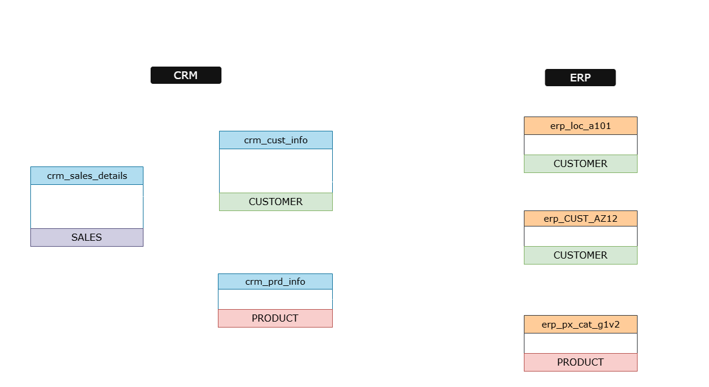
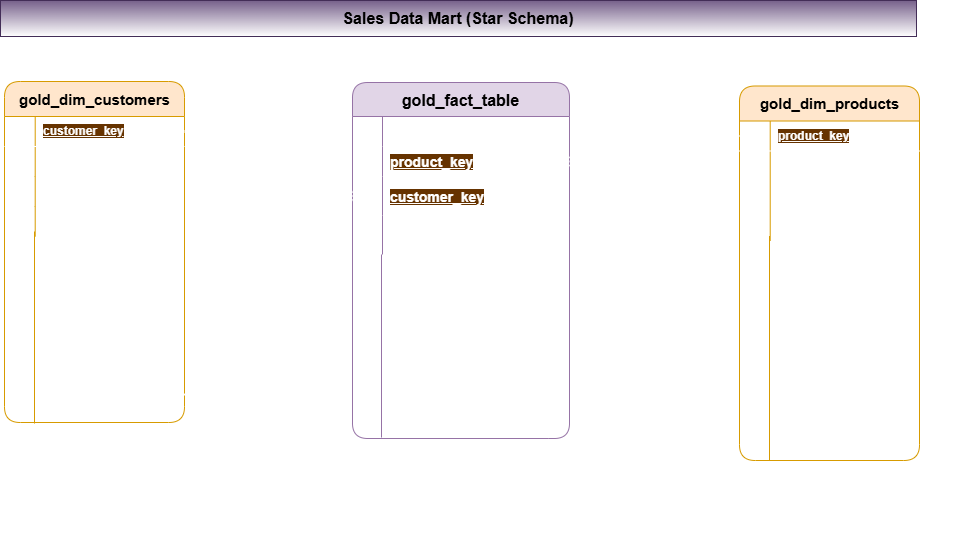

# 🛖 Data Warehouse and Analytics Project

Welcome to the Data Warehouse and Analytics Project Repository!                       
This portfolio project showcases a complete end-to-end data warehousing and analytics solution, from designing and building the data warehouse to uncovering actionable insights. It reflects industry best practices in both data engineering and analytics.

---

## 📝 Project Requirements
### Data Warehouse Development (Data Engineering)
#### Objective
Build a modern data warehouse using SQL Server to centralize sales data, supporting analytical reporting and data-driven decision-making.

Specifications

- **Data Sources**: Load data from two separate systems (ERP and CRM), provided in CSV format.

- **Data Quality**: Perform data cleansing and address any quality issues before analysis.

- **Integration**: Merge the datasets into a unified, easy-to-navigate data model optimized for analytics.

- **Scope**: Limit the project to the most recent data; historical data tracking is not needed.

- **Documentation**: Deliver comprehensive documentation of the data model to assist both business users and analytics teams.
--
### 📈 BI: Analytics & Reporting (Data Analysis)
#### Objective
Create SQL-driven analytics to uncover valuable insights into:

- **Customer Behavior**

- **Product Performance**

- **Sales Trends**

These insights equip stakeholders with essential business metrics, supporting informed and strategic decision-making.

---
## 📌 Project Overview

This project involves:
1. **Data Architecture**: Building a modern data warehouse leveraging the Medallion Architecture framework, incorporating Bronze, Silver, and Gold layers.
2. **ETL Pipelines**: Designing and implementing workflows to extract, transform, and load data from source systems into the data warehouse.
3. **Data Modeling**: Creating efficient fact and dimension tables tailored for advanced analytical querying.
4. **Analytics & Reporting**: Developing interactive reports and dashboards in Power BI to deliver actionable business insights.

---
## 🎯 Data Architecture

1. **Bronze Layer**: Captures raw data directly from source systems without any transformations. Data is imported from CSV files into a SQL Server database.
2. **Silver Layer**: Performs data cleansing, standardization, and normalization to refine the data and make it suitable for analysis.
3. **Gold Layer**: Contains fully prepared, business-ready data organized in a star schema format, optimized for reporting and analytical purposes.
---
## ⚙️ Data Integration

## ⌛ Data Flow

## 🏪 Sales Data Mart

---

 ## 🛡️License

This project is licensed under the MIT License. You are free to use, modify, and share this project with proper attribution.

